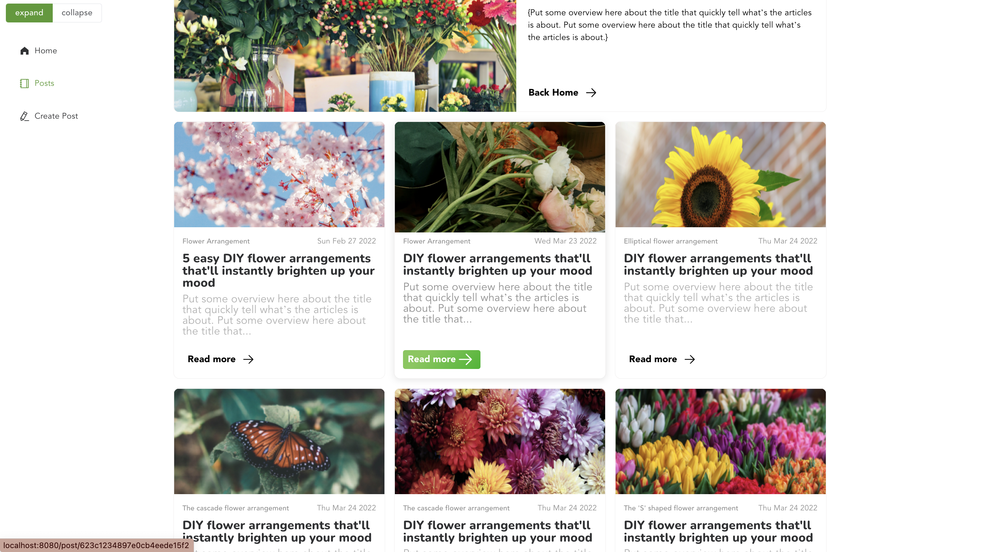

# Blog

**In progress



## Project setup

```
cd server
```

```
yarn install
```

### Start server

```
yarn start
```

### Start client

- split terminal
- cd client

```
yarn install
```

```
yarn dev
```

### Compiles and hot-reloads for development

```
yarn dev
```

### Compiles and minifies for production

```
yarn build
```

### Customize configuration

See [Configuration Reference](https://cli.vuejs.org/config/).
